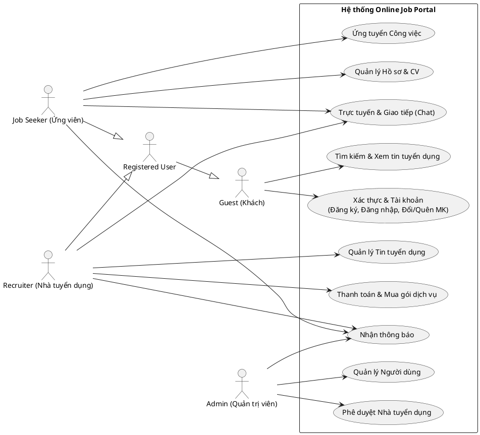
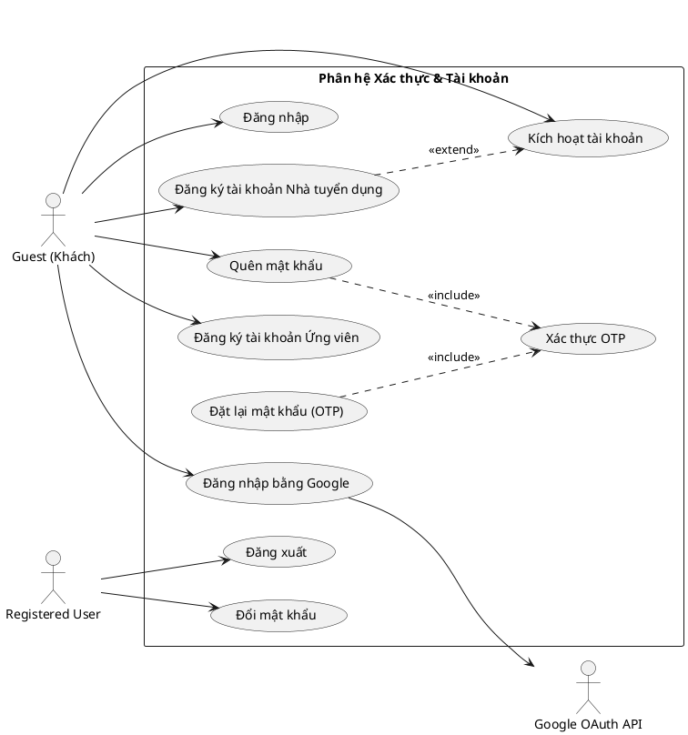
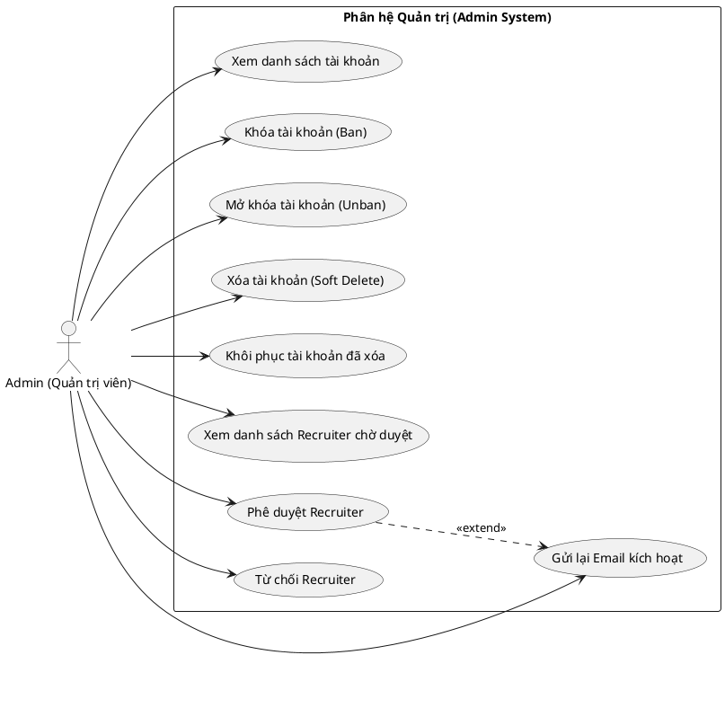
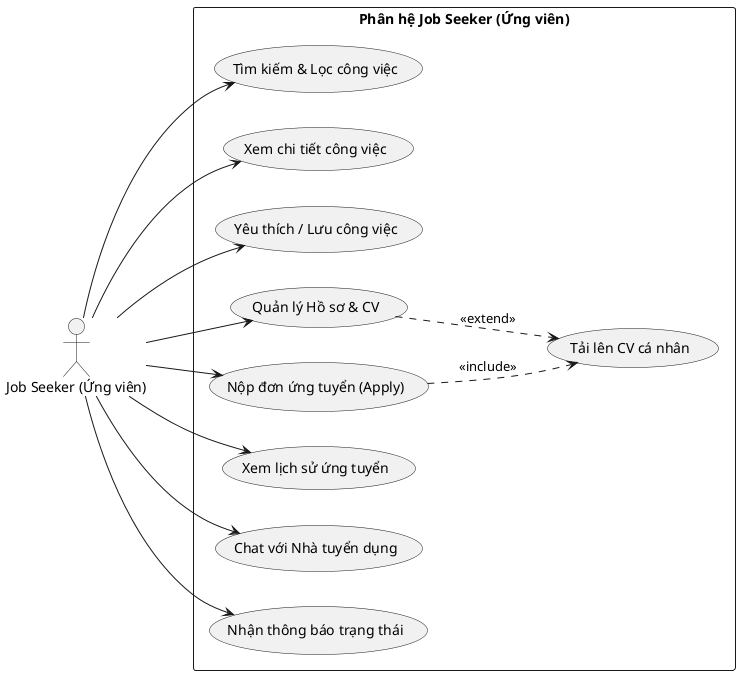
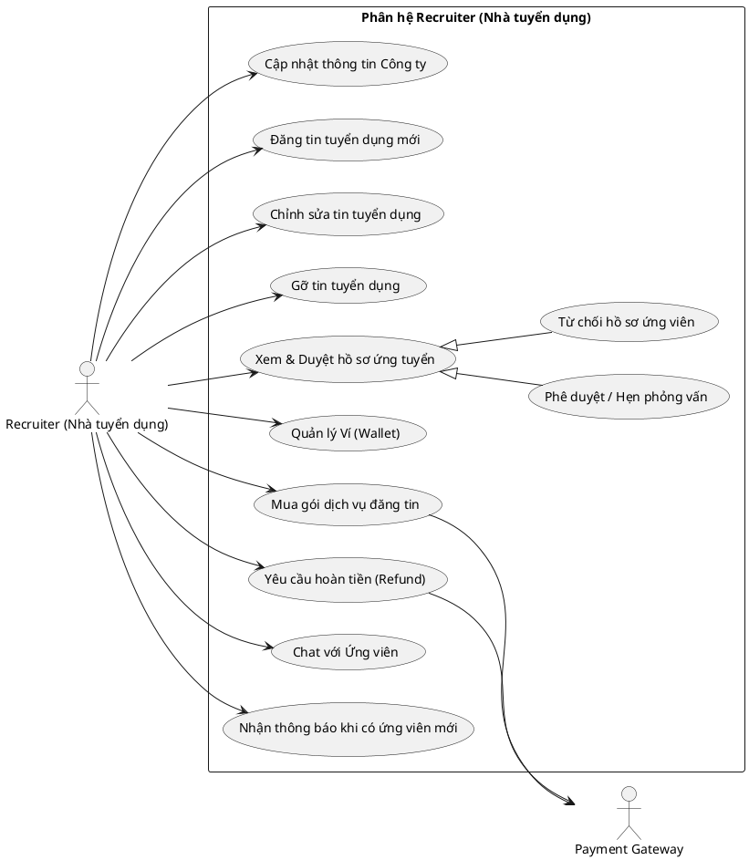

# Tài liệu Thiết kế Sơ đồ Use Case - Dự án Online Job Portal

Tài liệu này cung cấp chi tiết các tác nhân (Actors), sơ đồ Use Case tổng quan, và các sơ đồ Use Case chi tiết phân hệ (Authentication, Admin, Customer). 

Mỗi sơ đồ đều được cung cấp dưới dạng mã **Mermaid** (hiển thị trực quan ngay trong Markdown) và mã **PlantUML** (được sử dụng rất phổ biến trong các dự án của **FPT Software**).

---

## 1. Định nghĩa các Tác nhân (Actors)

| STT | Actor | Loại | Mô tả |
| :--- | :--- | :--- | :--- |
| 1 | **Guest** (Khách) | Primary | Người dùng chưa đăng nhập hệ thống. Chỉ có quyền xem tin tuyển dụng công khai, tìm kiếm công việc và đăng ký tài khoản. |
| 2 | **Job Seeker** (Ứng viên) | Primary | Người tìm việc. Kế thừa từ Guest sau khi đăng nhập. Có quyền nộp đơn, quản lý CV, yêu thích công việc, chat. |
| 3 | **Recruiter** (Nhà tuyển dụng) | Primary | Đại diện doanh nghiệp. Kế thừa từ Guest sau khi tài khoản được Admin phê duyệt & kích hoạt. Quyền đăng tuyển, duyệt CV, mua gói dịch vụ. |
| 4 | **Admin** (Quản trị viên) | Primary | Người quản trị hệ thống. Quản lý tài khoản, phê duyệt nhà tuyển dụng, quản lý hệ thống. |
| 5 | **Google OAuth API** | Secondary | Hệ thống bên thứ ba hỗ trợ xác thực tài khoản qua Google. |
| 6 | **Payment Gateway** (Cổng thanh toán) | Secondary | Hệ thống thanh toán bên thứ ba (ví dụ: Stripe/VNPAY) để xử lý giao dịch mua gói dịch vụ. |

---

## 2. Overview Use Case Diagram (Sơ đồ Use Case Tổng quan)

### 2.1. Sơ đồ trực quan (Mermaid)
```mermaid
usecaseDiagram
    actor Guest as "Guest\n(Khách)"
    actor User as "Registered User\n(Người dùng đã đăng ký)"
    actor JobSeeker as "Job Seeker\n(Ứng viên)"
    actor Recruiter as "Recruiter\n(Nhà tuyển dụng)"
    actor Admin as "Admin\n(Quản trị viên)"

    JobSeeker --|> User
    Recruiter --|> User
    User --|> Guest

    rect gray "Hệ thống Online Job Portal"
        usecase UC_Auth as "Xác thực & Tài khoản
--
(Đăng ký, Đăng nhập, Đổi/Quên MK)"
        usecase UC_JobSearch as "Tìm kiếm & Xem tin tuyển dụng"
        usecase UC_JobManage as "Quản lý Tin tuyển dụng"
        usecase UC_Apply as "Ứng tuyển Công việc"
        usecase UC_Profile as "Quản lý Hồ sơ & CV"
        usecase UC_Payment as "Thanh toán & Mua gói dịch vụ"
        usecase UC_Chat as "Trực tuyến & Giao tiếp (Chat)"
        usecase UC_Notify as "Nhận thông báo"
        usecase UC_AdminUser as "Quản lý Người dùng"
        usecase UC_AdminApprove as "Phê duyệt Nhà tuyển dụng"
    end

    Guest --> UC_Auth
    Guest --> UC_JobSearch

    JobSeeker --> UC_Profile
    JobSeeker --> UC_Apply
    JobSeeker --> UC_Chat
    JobSeeker --> UC_Notify

    Recruiter --> UC_JobManage
    Recruiter --> UC_Payment
    Recruiter --> UC_Chat
    Recruiter --> UC_Notify

    Admin --> UC_AdminUser
    Admin --> UC_AdminApprove
    Admin --> UC_Notify
```

### 2.2. Mã nguồn PlantUML


---

## 3. Authentication Use Case Diagram (Sơ đồ Use Case Xác thực)

### 3.1. Sơ đồ trực quan (Mermaid)
```mermaid
usecaseDiagram
    actor Guest as "Guest (Khách)"
    actor User as "Registered User\n(Người dùng đã đăng ký)"
    actor Google as "Google OAuth API"

    rect gray "Phân hệ Xác thực & Tài khoản"
        usecase UC_RegisterJS as "Đăng ký tài khoản Ứng viên"
        usecase UC_RegisterRec as "Đăng ký tài khoản Nhà tuyển dụng"
        usecase UC_Login as "Đăng nhập"
        usecase UC_LoginGG as "Đăng nhập bằng Google"
        usecase UC_Logout as "Đăng xuất"
        usecase UC_Forgot as "Quên mật khẩu"
        usecase UC_Reset as "Đặt lại mật khẩu (OTP)"
        usecase UC_ChangePass as "Đổi mật khẩu"
        usecase UC_VerifyOTP as "Xác thực OTP"
        usecase UC_Activate as "Kích hoạt tài khoản"
    end

    Guest --> UC_RegisterJS
    Guest --> UC_RegisterRec
    Guest --> UC_Login
    Guest --> UC_LoginGG
    Guest --> UC_Forgot
    Guest --> UC_Activate

    User --> UC_Logout
    User --> UC_ChangePass

    UC_LoginGG --> Google
    
    UC_Forgot ..> UC_VerifyOTP : <<include>>
    UC_Reset ..> UC_VerifyOTP : <<include>>
    UC_RegisterRec ..> UC_Activate : <<extend>>
```

### 3.2. Mã nguồn PlantUML


---

## 4. Admin Use Case Diagram (Sơ đồ Use Case dành cho Admin)

### 4.1. Sơ đồ trực quan (Mermaid)
```mermaid
usecaseDiagram
    actor Admin as "Admin (Quản trị viên)"

    rect gray "Phân hệ Quản trị (Admin System)"
        usecase UC_ListUsers as "Xem danh sách tài khoản"
        usecase UC_BanUser as "Khóa tài khoản (Ban)"
        usecase UC_UnbanUser as "Mở khóa tài khoản (Unban)"
        usecase UC_DeleteUser as "Xóa tài khoản (Soft Delete)"
        usecase UC_RestoreUser as "Khôi phục tài khoản đã xóa"

        usecase UC_ListRecs as "Xem danh sách Recruiter chờ duyệt"
        usecase UC_ApproveRec as "Phê duyệt Recruiter"
        usecase UC_RejectRec as "Từ chối Recruiter"
        usecase UC_ResendMail as "Gửi lại Email kích hoạt"
    end

    Admin --> UC_ListUsers
    Admin --> UC_BanUser
    Admin --> UC_UnbanUser
    Admin --> UC_DeleteUser
    Admin --> UC_RestoreUser

    Admin --> UC_ListRecs
    Admin --> UC_ApproveRec
    Admin --> UC_RejectRec
    Admin --> UC_ResendMail

    UC_ApproveRec ..> UC_ResendMail : <<extend>>
```

### 4.2. Mã nguồn PlantUML


---

## 5. Customer Use Case Diagram (Sơ đồ Use Case Khách hàng)

Trong hệ thống này, **Customer** được cấu thành từ hai đối tượng khách hàng sử dụng dịch vụ trực tiếp: **Job Seeker** (Ứng viên) và **Recruiter** (Nhà tuyển dụng).

### 5.1. Job Seeker Use Case Diagram (Ứng viên)

#### 5.1.1. Sơ đồ trực quan (Mermaid)
```mermaid
usecaseDiagram
    actor JobSeeker as "Job Seeker (Ứng viên)"

    rect gray "Phân hệ Job Seeker (Ứng viên)"
        usecase UC_SearchJob as "Tìm kiếm & Lọc công việc"
        usecase UC_ViewJob as "Xem chi tiết công việc"
        usecase UC_FavJob as "Yêu thích / Lưu công việc"
        
        usecase UC_ManageProfile as "Quản lý Hồ sơ & CV"
        usecase UC_UploadCV as "Tải lên CV cá nhân"
        
        usecase UC_ApplyJob as "Nộp đơn ứng tuyển (Apply)"
        usecase UC_ViewAppHistory as "Xem lịch sử ứng tuyển"
        
        usecase UC_Chat as "Chat với Nhà tuyển dụng"
        usecase UC_Notify as "Nhận thông báo trạng thái"
    end

    JobSeeker --> UC_SearchJob
    JobSeeker --> UC_ViewJob
    JobSeeker --> UC_FavJob
    JobSeeker --> UC_ManageProfile
    JobSeeker --> UC_ApplyJob
    JobSeeker --> UC_ViewAppHistory
    JobSeeker --> UC_Chat
    JobSeeker --> UC_Notify

    UC_ApplyJob ..> UC_UploadCV : <<include>>
    UC_ManageProfile ..> UC_UploadCV : <<extend>>
```

#### 5.1.2. Mã nguồn PlantUML


### 5.2. Recruiter Use Case Diagram (Nhà tuyển dụng)

#### 5.2.1. Sơ đồ trực quan (Mermaid)
```mermaid
usecaseDiagram
    actor Recruiter as "Recruiter (Nhà tuyển dụng)"
    actor Payment as "Payment Gateway"

    rect gray "Phân hệ Recruiter (Nhà tuyển dụng)"
        usecase UC_Company as "Cập nhật thông tin Công ty"
        
        usecase UC_PostJob as "Đăng tin tuyển dụng mới"
        usecase UC_EditJob as "Chỉnh sửa tin tuyển dụng"
        usecase UC_DeleteJob as "Gỡ tin tuyển dụng"
        
        usecase UC_ManageApp as "Xem & Duyệt hồ sơ ứng tuyển"
        usecase UC_ApproveApp as "Phê duyệt / Hẹn phỏng vấn"
        usecase UC_RejectApp as "Từ chối hồ sơ ứng viên"
        
        usecase UC_Wallet as "Quản lý Ví (Wallet)"
        usecase UC_BuyPackage as "Mua gói dịch vụ đăng tin"
        usecase UC_Refund as "Yêu cầu hoàn tiền (Refund)"
        
        usecase UC_Chat as "Chat với Ứng viên"
        usecase UC_Notify as "Nhận thông báo khi có ứng viên mới"
    end

    Recruiter --> UC_Company
    Recruiter --> UC_PostJob
    Recruiter --> UC_EditJob
    Recruiter --> UC_DeleteJob
    Recruiter --> UC_ManageApp
    Recruiter --> UC_Wallet
    Recruiter --> UC_BuyPackage
    Recruiter --> UC_Refund
    Recruiter --> UC_Chat
    Recruiter --> UC_Notify

    UC_ManageApp <|-- UC_ApproveApp
    UC_ManageApp <|-- UC_RejectApp
    
    UC_BuyPackage --> Payment
    UC_Refund --> Payment
```

#### 5.2.2. Mã nguồn PlantUML

